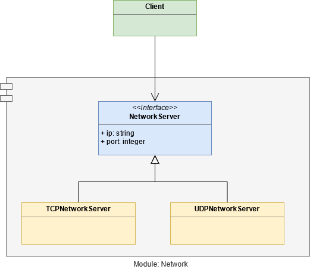

[Back (Implementation I)](../project/impl_1/impl_1.md) 

# What is good design?

In this chapter we try to answer the fundamental question: What is good design? How can it be described? And what questions do we need to ask ourselves during development that will lead to good design?

## Easy To Change

It is difficult to break "good design" down into a single value. But Andrew Hunt and Dave Thomas did a great job in the book [Pragramatic Programmer](./literature.md). They stated: **"Good design is easier to change than bad design"**. 

That's it. That is the ETC princple: *Easier to change. ETC*. 

A system has a good design if it is easy to change. If it is difficult to change, than the design is bad. It is that simple.

Keep the ETC value in your head during the proceeding of this course. Ask yourself during the development: "Will this kind of implementation make my system easier or harder to change in future?".

At this point you should have implemented a TCP network connection to receive books in the json format over network. Ask yourself: "Is it easy for a me to change to another network framework? Is it easy for me to change the transmission protocol to UDP?".

If your answer is "yes", it is more likely that your design is good. 

Most design principles, patterns and acronyms are closly related to the ETC value. We will talk about simplicity and readability now, but there is more to come during the course.

## Simplicity
A good design is simple and easy to understand. If we can understand it well, we can change it more easily. So this property directly pays into the **ETC** property.

If you have the same functionality in two systems (system *A* and *B*) and system *A* is way simpler (e.g. less code, less classes, little inheritance hierarchie), than the simpler system *A* is more likely to be the better system.

There is a myth about the NASA paying thousands of dollers to a company which should delevope a ball pen that can write in space without gravity, the so called *space pen*. The myth stated that the sowjet union just uses a lead pencil in space.

It's a modern myth and proven, that it is not the truth, but it gets the point very well. Both pens provide more or less the same functionality, but one is way simpler so the solution is superior.  

## Readability
 Source code is written once and maybe changed one time on a later point while refactoring, but it is read way more often. So if we can understand the source code quite well, we can change it more easily. That's why readability is also a supporting metric to ETC. 

# How do we want to change the system?
If we need to change our system, e.g. we get a new requirement from our customers that we need to implement, than the question arises: *How* do we want to change the system?

We can implement new features by **changing existing code** or by **adding new code**. The **open-close-principle** (originated by Bertrand Meyer in the 1980s) states, that a system is easier to change, if we can implement a new requirement by adding new code, rather than changing existing code (the system is open for extension, but closed for modification).

Let's have a look at this example:

The above picture shows an UML class diagram. A client (this can be simply another class) has a dependency to an abstract `NetworkServer`. This `NetworkServer` has two implementations: a `TCPNetworkServer` and an `UDPNetworkServer`.

Because we already have the right abstractions (in this case the interface `NetworkServer`) it is very easy for us to implement a different kind of network server by adding a new class that will inherit from NetworkServer. 

We have fullfilled the open-close-principle (OCP). Due to this principle we also fulfill the value *easy to change* (ETC) and so we can consider our design as good.

# How can we find the right abstractions in our system?

We find the right abstractions by anticipating what will change in the future. If we assume that it is likely that some component will be extended or changed in the future, we are well advised to design our system flexibel by using an abstraction. 

Of course it is not easy to predict what will change in the future. If unsure, it is in most cases better to make a component replaceable so it won't be a roadblock.

# Too much abstraction

Abstractions make our system easier to change but this flexibility comes with a disadvantage: it increases the complexity and makes our system harder to understand. 

So if we design our system too abstract we actually make it worse instead of better. So there is a tradeoff between flexibility by abstraction and complexity.

You may already know a similar trade of: the tradeoff between computational complexity and disc space. We can save computational ressources if we store precalculated values on disc. But this leads to more occupied disk space. 

So we must decide from case to case if the abstraction is really needed or makes if it does make our system to complex in worst case.

[Back (Implementation I)](../project/impl_1/impl_1.md) 
