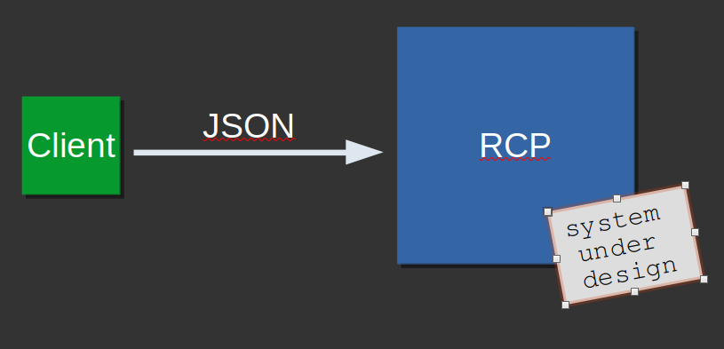

[Back to Implementation I](../project/impl_1/impl_1.md)

# System overview
Imagine our Recommerce platform is being used by a startup. A small team is responsible for the acquisition of used books and has to enter them into the system.  The management of the books has to be done in a structured format, in our case this is the JSON schema. 

From the perspective of our system, the team that enters the books into the system is a client. A client is a synonym for someone who uses our system. This can be a human being, but also another system. From the perspective of our recommerce platform, this makes no difference. 

From the requirements follows that the Recommerce Platform should receive the JSON files over network. How many files need to be processed is not specified. This is a great attribute described in a quality scenario ;)

To receives bytes over network we need a socket. 

# Sockets
A socket is an object responsible for receiving and transmitting data, in most cases over network. 

To be able to receive data we must first create a socket. For that we must open a port on our RCP and define the network interface on which we expect the client to send data to. 

The interface is the network card of your computer. You can use a wired or wireless connection or also listen on all interfaces of your computer. How to do this? I am sure, google will help you with that question ;)

Your programming language will offer you a stream-oriented (TCP) or datagram-oriented (UDP) socket. As statet in the requirements, use a TCP socket for your connection. 

A network socket is uniquely descibed from the combination of an IP address and port. But what port to use exactly? 

## What is a port and which port to use?
A port is a software based number between `1` and `65535`. It is used to distinguish network communication for specific services. To get only the exact data a service needs, it uses its own unique port. 

Ports between `1` and `1024` are so called `Well known ports`. It is highly **discouraged** to use a port for your application in this range. If you ignore the warning and do so anyway it is likely that you get a port collision when the port is already used, but no one hinders you from doing that. 

Some examples for well known ports are port 80 which is typically used for HTTP, port 22 is used for SSH, port 23 for FTP and so on. Ports are officially managed by an organisation called IANA (Internet Assigned Numbers Authority). 

Have a look at [this](https://en.wikipedia.org/wiki/List_of_TCP_and_UDP_port_numbers) wikipedia page to get an overview of applications and the ports they use. 

It is recommended to choose a port between 20.001 and 20.559.  It is unlikely that an application will already use a port within that range. 

# Why is the network connection needed?
A network connection is not necessarily needed, but it is very convenient. We could also import the data by file from a USB device. But what would be the implications for the system and the users of the system?

Each time new books are purchased, a person would need to access the system on site and import the data into the system from a USB drive. While this is not technically a problem, it is certainly impractical and that's why a network connection is the better approach. 

[Back to Implementation I](../project/impl_1/impl_1.md)
