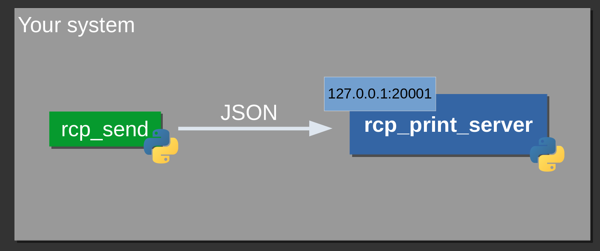

[Back (preparation)](./preparation.md) | [Next (Implementation II)](./impl_2.md)

# Implementation part I
In this chapter you will implement the network receival and convert transmitted bytes to a JSON file. You will reflect on possibilites how to structure internal representation of data and learn about general principles in software design. 

To begin with this chapter make sure your status quo looks like this:

## Status Quo:
At this point you should have an empty project in your prefered programming language. There is a separate repository for the project and every group member should have access to it. If this is not the case, go back to the [preparation steps](./preparation.md).

You should also have a basic unterstanding of the requirements and the quality attributes your system has to fulfill.

# Receiving JSON files over network connection
The RCP needs to process `JSON` files over network. For that you need the following:

- Start your implementation by using a TCP socket to receive data over network
- Open a configurable port and listen for new connetions
- A client will establish a new connection for every file that needs to be transmitted 

The connection will be closed by the client if the file is transmitted completely. By closing the connection on client side you will know, when the transfer is completed.

Once the file is transmitted, convert the raw bytes received into a `json-object`. That object can be validated with the provided schema file `./json/json_file.schema`.  

If this description was to fast paced for you and you need a gentle introduction into socket programming, feel free to check out [this](../../material/network.md) introduction to network sockets.

## Simulating a client
To simulate a client you can use the program `rcp_send.py` in the directory `content/project/impl_1`. With this application you can send JSON files to your RCP.

To run the application you need a python installation. If you have no python interpreter installed, you can download an interpreter [here](https://python.org).

The python script can transfer JSON files from the folder `json` over network. You can browse the folder and inspect the JSON files manually and also save new JSON files to that folder to transmit them over network. For that make sure, that the file ending is `.json` (other file endings are filtered by the application). 

You can test your network settings and file transmission on your local machine by using `rcp_print_server.py`.
By starting the `rcp_print_server` it will open port `20.001` and wait for connection.

```bash
$ python3 ./rcp_print_server.py 
Waiting for connection...
```

Now start the script `rcp_send` on another terminal and use it as followed:

```bash
$ python3 ./rcp_send.py 
--- Select file for transmission | Ctrl+C to terminate ---
[0]: book_4.json
[1]: book_2.json
[2]: book_1.json
[3]: book_3.json
File number: 
```

Select the file number for the file to be transmitted. 

```bash
...
[3]: book_3.json
File number: 1
[TRY]	Transmitting file book_2.json
[TRY]	Connecting to 127.0.0.1:20001 .....
[OK]	Connection established
[OK]	Transmission done (290 bytes transmitted)
[OK]	Closing connection
--- Select file for transmission | Ctrl+C to terminate ---
```



The ip address *127.0.0.1* is the so called loopback address and can be used to send data over network your own system. 

```bash
$ python3 ./rcp_print_server.py
Got connection from ('127.0.0.1', 57196)
b'{\n   "title": "Atomic Habits: An Easy & Proven Way to Build Good Habits & Break Bad Ones",\n   "author": "James Clear",\n   "isbn-10": "0735211299",\n   "quality": "very good",\n   "language": "english",\n   "publication_date": "2018/010/16",\n   "type": "hardcover",\n   "purchase_price": 2.90\n}\n'
```

Your job is now to get rid of the `rcp_print_server` which is just used for demonstration purposes and replace it with your own first version of the Recommerce platform.

# Experiments

1) Try to run the Recommerce Platform and the `rcp_send` script on different systems. What needs to be changed within the `rcp_send` script?

2) Add your own books in the JSON format within the JSON directory. Try to transmit them with the `rcp_send` script. 

# Definition of Done
You are done when:

- You have a working implemenation of a network server within your RCP
- The network server can receive and process JSON files
- You have an internal representation of the JSON files
- You have manually or automatically testet your system and everything works as expected

# Questions for reflection
1) How does the internal representation of your JSON data look like?

2) Where is the interface and port of your network socket configured? Is it hard coded in source code or changeable via a configuration file?

3) What is the difference between TCP and UDP? Why is TCP the appropriate transmission protocol for this use case?

4) Do you have any automatic tests for your system? How can your system be tested? How does the network retrieval of data over network affect your ability to test your system?

# Further readings

- [Testing your system](../../material/testing.md)
- [Abstraction](../../material/abstraction.md)
- [Why a Version Control System is important](../../material/vcs.md)

[Back (preparation)](./preparation.md) | [Next (Implementation II)](../impl_2/impl_2.md)
