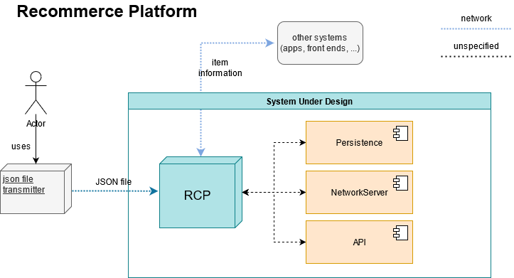

[Back (Preparation)](./preparation.md) | [Next (Implementation I)](./impl_1/impl_1.md)

# System overview

We now know our three main requirements that we need to implement:

- Processing book information as JSON files over network
- Persistance of information
- Providing an interface to request information about available books (also over network)

We can assume, that the requirements will not be final and will be extended or changed during the lifetime of our system.

## System context
Let's give an overview over our system and the communication partners/clients of our system. For that overview we use a system context diagram.

A system context diagram shows the boundaries of our system and shows other systems which interact with the RCP (referred to as the "System Under Design"). 

The overview shows an actor using a program called `json file transmitter`. This tool is used to send book information to our platform.

Other systems communicating with the RCP request item information and process them. This could be, for example, a shopping app that queries information about available used books and displays them in the app, or a website.

To have a rough structure of our RCP it is separated in three parts. Each part is responsible for a specific requirement. The components may consist of other parts, but this is not specific at the moment. 

It is also not specified if the components are separate processes or logical software components within one application.

## Quality scenario

When we design and implement our system, we can do this regarding specific quality attributes.  [ISO 25010](https://iso25000.com/index.php/en/iso-25000-standards/iso-25010) gives an overview over quality attributes, as seen in the following picture.

It does not make sense to design our system regarding *all* quality attributes. We need to think about use cases of our system and try to anticipate which quality attributes makes sense in our context. 

The implemenation of quality attributes siginificantly influences the design of our system. It should be clear that designing a system which must be very high performant has other components and structures than a system having the highest requirements regarding security. 

# Exercise

1) What are important qualities attributes we need to consider in our system design and implementation?

2) Try to describe quality scenarios for your identified quality attributes. Examples for 
quality scenarios are the following: 

    1) *"Time behaviour: The platform must be able to import at least 15 books per second over the network interface"*

    2) *"Resource Utilization: The platform must be able to store at least 50.000 books"*

    3) ...

[Back (Preparation)](./preparation.md) | [Next (Implementation I)](./impl_1/impl_1.md)

